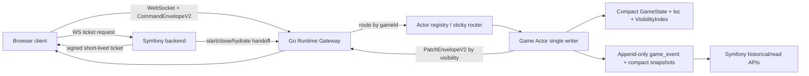

# ADR: Go Game Runtime Service

Status: proposed

Date: 2026-06-21

## Context

CommanderZone gameplay currently runs through Symfony requests, ORM entities, legacy snapshots, and realtime patches derived from projected previous/next snapshots. That model is correct enough functionally, but it keeps the hot path tied to database locks, full snapshot rewrites, full normalization, and projection diff work.

The target architecture keeps Symfony as the product backend for auth, decks, rooms, start/rematch/close, history, and admin flows. Active gameplay moves to a dedicated runtime service optimized around a single-writer game actor, compact state, append-only events, and semantic patches.

This does not turn CommanderZone into a full Magic rules engine. The runtime remains a manual Commander table command processor.

## Decision

Introduce a separate Go service named `game-runtime`. It will be opt-in behind Symfony feature flags and will use the existing V2 contracts as its external protocol:

- `CommandEnvelopeV2`
- `PatchEnvelopeV2`
- `EventPayloadV2`
- compact `GameState`

Symfony remains the source of truth for users, rooms, decks, permissions, game creation, game close, and historical APIs. Go owns the active gameplay hot path for games routed to it.

## Architecture

## Game Runtime Gateway

Responsibilities:

- Accept gameplay WebSocket connections only with a Symfony-issued runtime ticket.
- Validate ticket signature, expiry, `userId`, `gameId`, room membership, and protocol version.
- Validate the incoming `CommandEnvelopeV2` shape before enqueueing.
- Route commands by `gameId` to the owner actor.
- Support either process-local sticky routing or an external registry later.
- Apply connection-level and per-game backpressure.
- Emit `PatchEnvelopeV2` only to authorized viewers.

Ticket contract:

- Symfony issues short-lived tickets after normal auth.
- Ticket claims include `userId`, `gameId`, `roles`, `viewerKind`, `issuedAt`, `expiresAt`, `protocol`.
- Runtime never trusts client-sent `playerId` for privacy or permissions; it uses ticket claims and server state.

Routing:

- Phase 1: single runtime process, in-memory actor registry.
- Phase 2: sticky routing at load balancer by `gameId`.
- Phase 3: optional registry/lease table for actor ownership if horizontal runtime is needed.

## Game Actor Per Game

Each active game has one actor:

- Single writer for that `gameId`.
- Bounded mailbox queue.
- Compact `GameState` in memory.
- `loc[instanceId]` index for O(1) lookup.
- `VisibilityIndex` for incremental privacy decisions.
- Granular command appliers.
- `PatchEmitter` that groups ops by visibility: `public`, `player:<id>`, `group:<mask>`.
- Backpressure and command shedding for visual/ephemeral traffic.

Normal command flow:

1. Gateway validates ticket and envelope.
2. Actor checks `baseVersion` and `clientActionId`.
3. Actor dispatches by `type`.
4. Applier validates permissions from state and actor claims.
5. Applier mutates only affected fields/zones.
6. Applier emits compact event payload and semantic patches.
7. Actor appends `game_event` transactionally.
8. Actor increments version and publishes patches after append success.

This makes simple commands tend to O(1) and batch commands tend to O(k), where k is the affected instance count.

## Compact GameState

The runtime state mirrors the PHP compact state design:

- `gameId`
- `version`
- `status`
- `players`
- `turn`
- `instances: map[InstanceID]CardInstanceRuntime`
- `zones: map[PlayerID]PlayerZones`
- `loc: map[InstanceID]Location`
- `visibility`
- `relations`
- `stack` as compact references only, not full cards

Static card payload is not stored inside instances. Rendering hydrates by `cardKey/cardVersion` from the catalog/cache.

## VisibilityIndex

Privacy is release-blocking. The runtime owns privacy decisions for active gameplay:

- own hand is visible to owner
- opponent hand/library are placeholders/counts unless revealed
- library top reveal windows use generation/epoch, not per-card cleanup
- face-down cards do not leak `cardKey`
- patches are grouped by visibility before broadcast
- spectators receive only allowed groups

The actor must not broadcast an op containing `cardKey` or static card fields unless the target visibility group is authorized.

## Persistence

Runtime persistence is event sourced:

- `game_event(game_id, version, type, payload, created_by, client_action_id, created_at)`
- `game_snapshot_compact(game_id, version, snapshot, checksum, created_at)`

Append guarantees:

- `version` is monotonic per game.
- `unique(game_id, version)` prevents double append.
- `unique(game_id, client_action_id)` provides idempotency.
- Patches are emitted only after append success.

Replay:

1. Load latest compact snapshot.
2. Load events after snapshot version.
3. Replay events in version order.
4. Rebuild `loc`, `VisibilityIndex`, relation indexes.
5. Validate checksum and invariants.

Compact snapshots are written every N events, every N seconds, and on close.

## WebSocket Protocol

Inbound:

- `CommandEnvelopeV2`
- optional reconnect message with `lastAppliedVersion`
- optional ephemeral visual presence messages, rate limited and discardable

Outbound:

- `PatchEnvelopeV2`
- ack through `ackClientActionId`
- gap/resync response only for version gap, corruption, protocol mismatch, or unavailable actor

Reconnect:

- If `lastAppliedVersion` is within retained patch/event window, replay patches or rebuild viewer bootstrap delta.
- If not, return resync-required and force `BootstrapV2`.

## Symfony Integration

Symfony remains responsible for:

- auth/session
- runtime ticket issuance
- deck import/editor/validation
- room public/private/invites/readiness
- game start/rematch/close decisions
- historical APIs and admin/debug endpoints

Runtime-owned during active gameplay:

- command serialization per game
- compact in-memory state
- event append
- semantic patches
- active viewer fanout

Start game contract:

1. Symfony creates current `Game` and initial snapshot as today.
2. If runtime feature flag is enabled, Symfony sends or exposes initial compact bootstrap to runtime.
3. Runtime hydrates actor from compact snapshot.
4. Symfony returns runtime endpoint and signed WS ticket to clients.

Close game contract:

1. Close command is accepted by runtime or Symfony control plane.
2. Runtime writes final event and compact snapshot.
3. Runtime releases actor.
4. Symfony marks game closed and serves history from events/streams.

## Migration Plan

1. Keep current Symfony gameplay as default.
2. Add runtime service skeleton and contract parity tests.
3. Add Symfony runtime ticket endpoint behind feature flag.
4. Mirror selected V2 commands to runtime in shadow mode for deterministic comparison.
5. Route one low-risk command set to runtime for internal games.
6. Move simple commands: life, turn, dice, tap, counters, final position.
7. Move library and zone commands after privacy golden tests pass.
8. Move reconnect/bootstrap V2.
9. Disable legacy snapshot writes for runtime-routed games.
10. Retain Symfony fallback/resync until production metrics prove stability.

## How This Removes Current Hot Path Costs

- No DB lock per command: the actor mailbox is the serializer; DB only sees append-only inserts.
- No snapshot full write per command: normal write is one compact `game_event`.
- No previous/next projection diff: command appliers emit semantic patches directly.
- No zone scans by `instanceId`: actor state has `loc[instanceId]`.
- No static payload duplication: instances carry `cardKey/cardVersion`; catalog is separate.

## Open Questions

- Runtime ticket signing format: HMAC shared secret vs asymmetric JWT.
- Actor ownership registry: postpone until more than one runtime process is required.
- Patch replay retention window for reconnect without bootstrap.
- Whether Symfony or runtime owns final authoritative close for disconnect votes.
